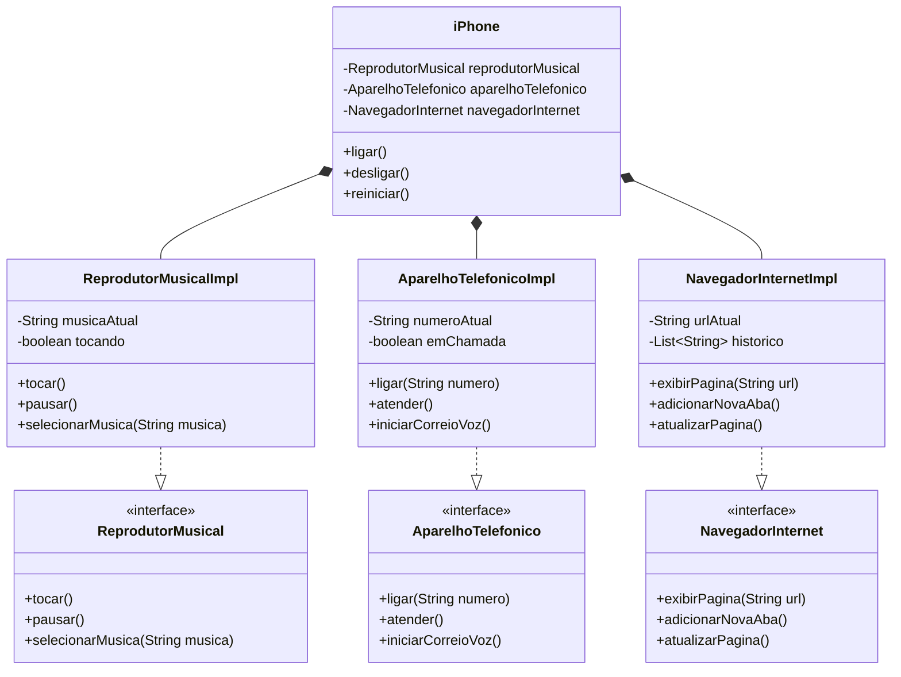

# Desafio POO - Modelagem e Implementação de um iPhone

Este projeto apresenta uma modelagem UML e implementação Java de um simulador das principais funcionalidades do iPhone, conforme mostrado no vídeo de lançamento de 2007. O sistema implementa as funcionalidades de Reprodutor Musical, Aparelho Telefônico e Navegador na Internet com uma interface interativa para o usuário.

## Visão Geral

O projeto foi desenvolvido utilizando os princípios de Programação Orientada a Objetos, incluindo:

- Abstração
- Encapsulamento
- Interfaces
- Polimorfismo
- Composição

## Estrutura do Projeto

### Interfaces

- `ReprodutorMusical.java` - Define o contrato para funções de reprodução musical
- `AparelhoTelefonico.java` - Define o contrato para funções de telefonia
- `NavegadorInternet.java` - Define o contrato para funções de navegação na internet

### Implementações

- `ReprodutorMusicalImpl.java` - Implementa as funções do reprodutor musical
- `AparelhoTelefonicoImpl.java` - Implementa as funções de telefonia
- `NavegadorInternetImpl.java` - Implementa as funções de navegação

### Classe Principal

- `iPhone.java` - Integra todas as funcionalidades através de composição
- `Main.java` - Fornece interface interativa com o usuário via console

## Funcionalidades Implementadas

### Controles do iPhone

- **Ligar**: Ligar o dispositivo
- **Desligar**: Desligar o dispositivo
- **Reiniciar**: Reinicializa o dispositivo

### Reprodutor Musical

- **Selecionar Música**: Permite escolher uma música pelo nome
- **Tocar**: Inicia a reprodução da música selecionada
- **Pausar**: Pausa a reprodução da música atual
- **Status**: Exibe a música atual e seu estado de reprodução

### Aparelho Telefônico

- **Ligar**: Realiza uma chamada para um número específico
- **Atender**: Atende uma chamada recebida
- **Iniciar Correio de Voz**: Acessa o sistema de correio de voz

### Navegador de Internet

- **Exibir Página**: Carrega uma página web a partir de uma URL
- **Adicionar Nova Aba**: Cria uma nova aba no navegador
- **Atualizar Página**: Recarrega a página atual

## Interface do Usuário

O sistema possui uma interface interativa via console com um menu principal e submenus para cada funcionalidade:

- **Menu Principal**: Permite escolher entre as funcionalidades principais
- **Submenus Persistentes**: Cada submenu permanece ativo até que o usuário escolha voltar
- **Validação de Estado**: Verifica se o iPhone está ligado antes de permitir uso das funcionalidades
- **Feedback Visual**: Exibe informações de status e resultados de operações

## Diagrama UML



## Como Executar

Para executar o simulador do iPhone:

```bash
# Clone o repositório
git clone https://github.com/seu-usuario/desafio-poo-iphone.git
cd desafio-poo-iphone

# Compile os arquivos Java
javac *.java

# Execute o programa
java Main
```

## Instruções de Uso

1. Ao iniciar o programa, você verá o menu principal.
2. Primeiro, ligue o iPhone selecionando a opção 1 e depois a opção 1 novamente.
3. Após ligar o iPhone, você pode acessar qualquer uma das funcionalidades.
4. Em cada submenu, siga as instruções na tela para utilizar as funcionalidades.
5. Para sair de um submenu, selecione a opção 0.
6. Para encerrar o programa, selecione a opção 0 no menu principal.

## Tecnologias Utilizadas

- Java
- UML (Mermaid)
- vscode

## Autor

[Wellington Bezerra]
